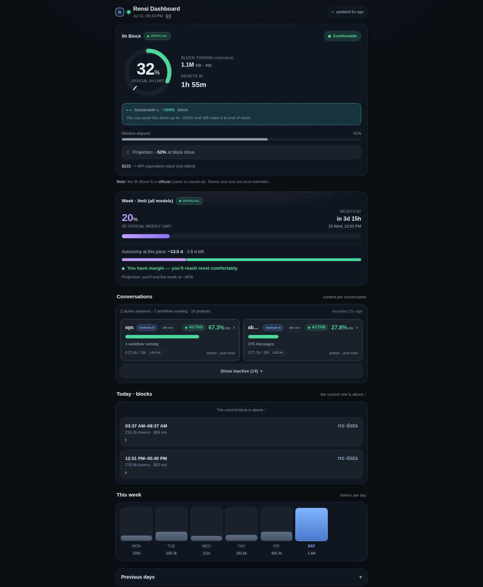
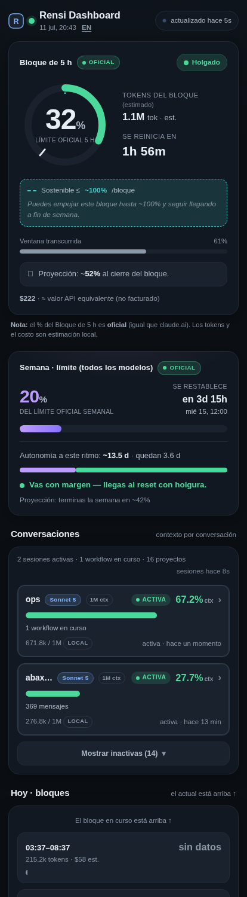

# Rensi Dashboard

Claude Code usage, live, self-hosted.

**English** · [Español](README.es.md)

<br clear="left"/>

[](LICENSE)
[](https://github.com/breisnerlopez/rensi-claude-dashboard/releases/latest)
[](pyproject.toml)

Binds to `127.0.0.1` only by default. Reads local Claude Code transcripts — nothing leaves your machine.



<sub>Mobile view, in Spanish (the UI follows your browser's language automatically):</sub>
<br/>


A self-hosted dashboard for [Claude Code](https://claude.com/claude-code) usage: official 5-hour and weekly rate limits, per-project token/cost estimates, and a **live view of every running session** — active subagents, workflows and their phases, open goals, and a full tool-use timeline, refreshed independently on a fast ~15s cycle.

If you find this useful, **a star helps other people find it** → see the link at the bottom.

## Quick start (2 commands, works in a couple of minutes)

Works on **Linux, macOS, and Windows**. No account, no config file to write by hand — the installer generates an access token, starts the dashboard, and opens it in your browser.

**Linux / macOS:**
```bash
curl -fsSL https://github.com/breisnerlopez/rensi-claude-dashboard/releases/latest/download/install.sh | bash
```

**Windows (PowerShell):**
```powershell
irm https://github.com/breisnerlopez/rensi-claude-dashboard/releases/latest/download/install.ps1 | iex
```

That's it — the script installs Python if you don't have it, installs the dashboard via [pipx](https://pipx.pypa.io/), registers it to start automatically (systemd user service / crontab on Linux, Task Scheduler on Windows), and opens `http://127.0.0.1:7681` with your access token.

These one-liners always fetch a **tagged release**, never the mutable `main` branch — a [`SHA256SUMS`](../../releases/latest) file ships with every release if you want to verify the download. Prefer to read the script before piping it into a shell? That's a completely reasonable thing to want — grab it from the [latest release page](../../releases/latest) first, or read [`install.sh`](install.sh) / [`install.ps1`](install.ps1) straight from the repo.

Once installed:
```bash
rensi-dashboard status   # is it running, and what's the URL
rensi-dashboard stop     # stop it
rensi-dashboard restart  # restart it
```

Optional, for the official rate-limit percentages (works without it too, in local-estimate-only mode):
```bash
pipx inject rensi-claude-dashboard claude-monitor
```

### Share it live

```bash
rensi-dashboard tunnel
```

Prints a temporary public URL (`*.trycloudflare.com`, via [Cloudflare Quick Tunnels](https://developers.cloudflare.com/pages/how-to/preview-with-cloudflare-tunnel/) — free, no account needed) so someone else can watch your live sessions right now. Requires [`cloudflared`](https://developers.cloudflare.com/cloudflare-one/connections/connect-networks/downloads/) — the command tells you how to install it if it's missing.

⚠️ This is a real, bigger exposure than the localhost-only default: the printed link includes your access token, so **anyone who has it can view your local Claude Code session data** for as long as the command keeps running. It's ephemeral by design — `Ctrl+C` closes the tunnel and nothing is left listening publicly. Don't leave it running unattended, and don't post the link somewhere public.

## What it shows

- **5h Block / Week** — the official rate-limit percentages, straight from Anthropic's usage API (same numbers as claude.ai), with a sustainability projection ("at this pace you have ~N days left").
- **Conversations** — one card per active/recent project: model + version, context-window size and occupancy, cost estimate, and a one-line status ("5/6 goals · 1 subagent running · 1 workflow running"). A repo checked out via `claude --worktree` (`<repo>--claude-worktrees-<name>` folders) collapses into a single expandable card grouped with its main checkout, instead of one card per worktree.
- **Session detail** (tap/click a card) — full detail for that session: goals with status and blockers, subagents with their descriptions and state, workflows with their phase pipeline, a tool-use histogram, and a scrollable activity timeline. On a wide screen this opens as a right-anchored panel with an independently-scrolling state column and activity column; on a phone it's a full-bleed sheet.
- **Today / This week / History** — token and cost trends over time.

Everything except the two official rate-limit percentages is explicitly labeled as a local estimate. The interface follows your browser's language automatically (English/Spanish today — see [Contributing](#contributing) to add another).

## How this differs

claude.ai's own usage page shows your official rate limits — this dashboard shows the same official numbers (it doesn't estimate or guess them) plus what claude.ai doesn't: a live view of what's actually running across your projects right now, and a local, per-project cost/token breakdown. The official percentages come from Anthropic's usage API via the optional [`claude-monitor`](https://github.com/Maciek-roboblog/Claude-Code-Usage-Monitor) CLI; without it, the dashboard still works, just without those two numbers.

## Architecture

```
rensi_dashboard/
  core.py       -- every path/bind/token, resolved from env vars with
                    OS-portable defaults (platformdirs). No box-specific
                    literals anywhere else in the package.
  aggregate.py   -- parses ~/.claude/projects/**/*.jsonl, optionally calls
                    the official usage API (via claude-monitor, if
                    installed), writes data.json + session/<slug>.json.
  server.py      -- stdlib http.server, whitelist routes only. Shared-secret
                    auth (header / cookie / one-time query param), fails
                    closed if no token is configured. Can run its own
                    in-process scheduler (two daemon threads, 180s/15s) so
                    a single process is enough on any OS.
  cli.py         -- `rensi-dashboard setup|start|stop|status|restart` and
                    `rensi-dashboard aggregate [--fast]` for anyone who'd
                    rather drive the scheduling themselves (systemd timers,
                    cron, Task Scheduler) instead of the built-in scheduler.
  web/index.html -- the whole frontend. No build step, no framework.
```

Two ways to run it:
- **`rensi-dashboard start`** (what the installer sets up) — one process, in-process scheduler, works identically on Windows/Mac/Linux.
- **Your own scheduler** — run `rensi-dashboard aggregate` / `rensi-dashboard aggregate --fast` on whatever cadence you want (systemd timers, cron, Task Scheduler) and `python3 -m rensi_dashboard.server --no-scheduler` as a plain supervised service. This is how the maintainer's own instance runs, behind Traefik + Authentik forward-auth — see `--no-scheduler` in `server.py` if you want that style instead.

## Security

This dashboard reads local Claude Code transcripts, which can contain business-sensitive detail (project names, file paths, commands). By default it binds to `127.0.0.1` only — nothing outside your machine can reach it unless you explicitly set `DASHBOARD_BIND`. Every request needs the access token (header, cookie, or the one-time `?t=` link the installer prints — which is scrubbed from the browser's address bar the instant the cookie is set).

If you put a reverse proxy in front of it (e.g. for remote access), have the proxy handle real authentication and keep the token check as a second layer — `server.py` refuses to start at all if no token is configured, so it can't accidentally run open.

A regex-based redactor strips common secret formats (API keys, tokens, PEM blocks) and filesystem paths from anything written to disk. It's a best-effort net, not a guarantee — don't widen `DASHBOARD_BIND` to `0.0.0.0` without something else guarding access.

**Platform notes:** the "active session" live badge (a running `claude --remote-control` process) is Linux-only in v1 — it simply never lights up on Windows/Mac yet, everything else works the same. The official rate-limit panel needs the optional `claude-monitor` dependency; without it the dashboard runs fine in local-estimate-only mode.

## Manual / advanced setup

Environment variables (all optional, sane defaults everywhere):

| Variable | Default | Meaning |
|---|---|---|
| `DASHBOARD_BIND` | `127.0.0.1` | interface to listen on |
| `DASHBOARD_PORT` | `7681` | port |
| `DASHBOARD_TOKEN` | auto-generated, persisted | access token |
| `DASHBOARD_DATA_DIR` | OS-appropriate app-data dir | where data.json/session/*.json/cache live |
| `CLAUDE_HOME` | `$HOME` | where `.claude/projects` and `.claude/tasks` are read from |
| `DASHBOARD_TZ` | `UTC` | timezone used for day/block boundaries |
| `DASHBOARD_FULL_INTERVAL` / `DASHBOARD_FAST_INTERVAL` | `180` / `15` (seconds) | in-process scheduler cadence |

## Contributing

This is a small, solo-maintained tool — issues and pull requests are welcome, no process ceremony. To run it locally: `pip install -e .` in a virtualenv, then `rensi-dashboard start --foreground`. See [CONTRIBUTING.md](CONTRIBUTING.md), including how to add a language to the UI (`STRINGS` dict in `rensi_dashboard/web/index.html`).

## License

MIT — see [LICENSE](LICENSE).

---

Built by [Breisner Lopez](https://breisner.info) ("Rensi") · [GitHub](https://github.com/breisnerlopez)

⭐ **If this is useful to you, starring the repo is the easiest way to say so** — it's how other people find small tools like this.

**English** · [Español](README.es.md)
